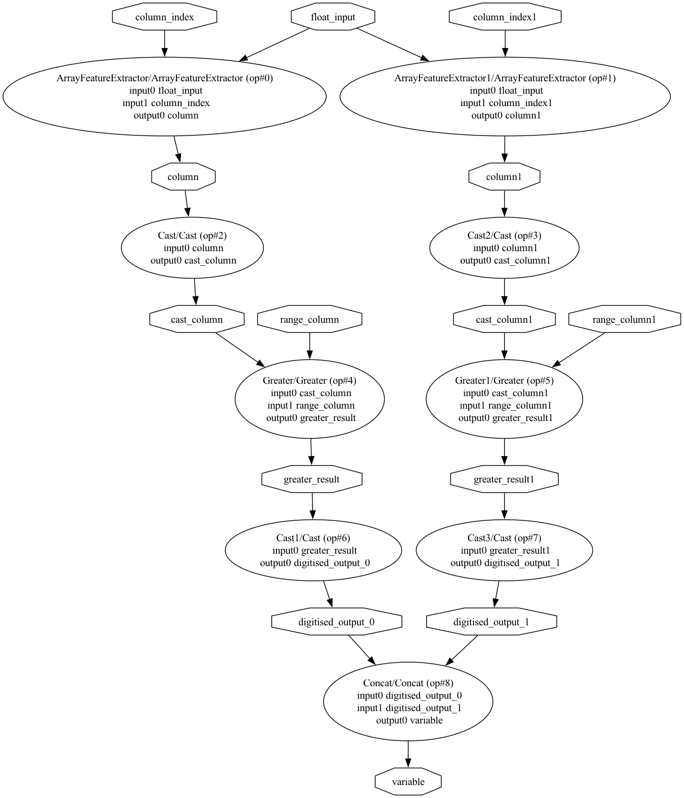

# ONNX converter for cumulative binning transformer

<div align="center">
  

</div>

## Install dependencies

Create a Python 3.12 virtual environment and activate it:

```bash
python3.12 -m venv venv
source ./venv/bin/activate
```

Next, install the required dependencies:

```bash
pip install -r requirements.txt
```

How to run unit tests:

```bash
pytest unit_tests.py
```